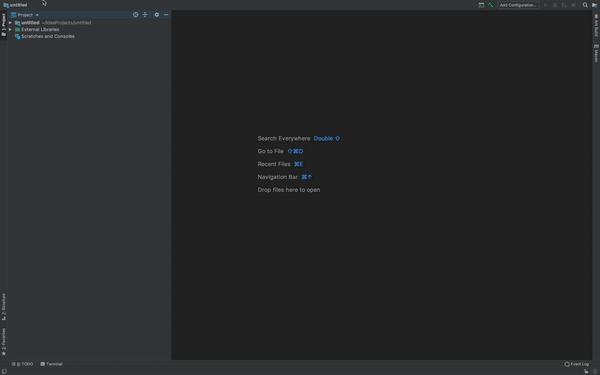
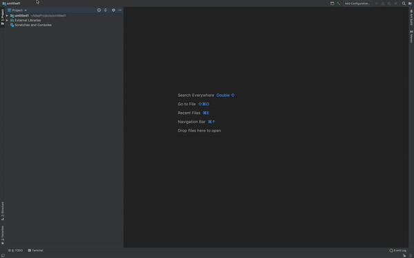

# The IntelliJ IDEA Ballerina Plugin

The IntelliJ Ballerina plugin provides the Ballerina development capabilities in IntelliJ IDEA. Click on the below links for instructions on how to download, install, and use the features of the IntelliJ plugin.

- [Downloading IntelliJ IDEA](#downloading-intellij-idea)
- [Installing the plugin](#installing-the-plugin)
- [Using the plugin](#using-the-plugin)
- [Using the features of the plugin](#using-the-features-of-the-plugin)

## Downloading IntelliJ IDEA 

Download the [IntelliJ IDEA editor](https://www.jetbrains.com/idea/download/).

## Installing the plugin

Use either of the below approaches to install the IntelliJ Ballerina plugin.

- [Installing via the IntelliJ IDEA editor](#installing-via-the-intellij-idea-editor)
- [Installing using the ZIP file](#installing-using-the-zip-file)

### Installing via the IntelliJ IDEA editor

1. Open the editor, click **IntelliJ IDEA** in the top menu, click **Preferences**, and then click **Plugins**. 

> **Tip:** If you are using Ubuntu/Windows, click **File**, click **Settings**, and then click **Plugins**.

2. In the search bar, type "Ballerina" and press the **Enter** key. 
3. Click **Install**, and then click **Accept**.
4. Click **Restart IDE**, and then click **Restart**.



This downloads the plugin and installs it.

### Installing using the ZIP file

Follow the steps below to install the plugin using its ZIP file.

1. [Obtaining the ZIP file](#obtaining-the-zip-file)
2. [Installing the ZIP file via the editor](#installing-the-zip-file-via-the-editor)

#### Obtaining the ZIP file

Follow either of the below approaches to obtain the ZIP file of the Ballerina plugin.

- [Downloading from the JetBrains Plugin Repository](#downloading-from-the-jetbrains-plugin-repository)
- [Building from the source](#building-from-the-source)

##### Downloading from the JetBrains Plugin Repository

Download the [IntelliJ Ballerina plugin](https://plugins.jetbrains.com/plugin/9520-ballerina).


##### Building from the source

Follow the steps below to obtain the ZIP file by building it from its source.

1. Clone the [ballerina-lang](https://github.com/ballerina-platform/ballerina-lang) GIT repo.
2. In a new Command Line tab, navigate to the source directory of the plugin (i.e., the `<CLONED_BALLERINA_DIRECTORY>/tool-plugins/intellij` directory), and execute the below command.

    > **Info**: In the above step,`<CLONED_BALLERINA_DIRECTORY>` refers to the path of the *ballerina-lang* Git repository, which you cloned locally. 

    > **Tip:** You need to install the [Gradle Build Tool](£https://gradle.org/) to execute the below command.

    ```bash
    ./gradlew buildPlugin
    ```
    > **Tip:** If you are using Ubuntu/Windows, execute the below command:
    ```bash
    gradlew buildPlugin
    ```

    This creates the `/build/distributions/ballerina-intellij-idea-plugin-[VERSION].zip` file locally in the `ballerina-platform/ballerina-lang/tree/master/tool-plugins/intellij/tree/master/tool-plugins/intellij` directory.

#### Installing the ZIP file via the editor

After obtaining the ZIP file using either of the above approaches, follow the steps below to install it using the IntelliJ IDEA Editor.


1. Open the editor, click **IntelliJ IDEA** in the top menu, click **Preferences**, and then click **Plugins**. 

> **Tip:** If you are using Ubuntu/Windows, click **File**, click **Settings**, and then click **Plugins**.

2. Click the cogwheel icon, and then click **Install plugin from disk...**.
3. Browse and select the ZIP file of the plugin you downloaded.

> **Important:** Make sure you install the ZIP file and not the extracted JAR files. This is because the ZIP file contains of an additional library that is required by the plugin to function as expected.

4. Click the **Installed** tab, click **Restart IDE**, and then click **Restart**.



## Using the plugin

For information on using the IntelliJ Ballerina plugin to write Ballerina programs, see [Using the IntelliJ Ballerina plugin](intellij-plugin/using-the-intellij-plugin.md).

## Using the features of the plugin

Click on the below links to find information on the various capabilities that are facilitated by the IntelliJ Ballerina plugin for the development process.

- [Running Ballerina programs](intellij-plugin/using-intellij-plugin-features.md#running-ballerina-programs)
- [Debugging Ballerina programs](intellij-plugin/using-intellij-plugin-features.md#debugging-ballerina-programs)
- [Importing modules on the fly](intellij-plugin/using-intellij-plugin-features.md#importing-modules-on-the-fly)
- [Importing unambiguous modules](intellij-plugin/using-intellij-plugin-features.md#importing-unambiguous-modules)
- [Finding usage](intellij-plugin/using-intellij-plugin-features.md#finding-usage)
- [Formatting Ballerina codes](intellij-plugin/using-intellij-plugin-features.md#formatting-ballerina-codes)
- [Viewing details of parameters](intellij-plugin/using-intellij-plugin-features.md#viewing-details-of-parameters)
- [Viewing documentation](intellij-plugin/using-intellij-plugin-features.md#viewing-documentation)
- [Adding annotation fields via suggestions](intellij-plugin/using-intellij-plugin-features.md#adding-annotation-fields-via-suggestions)
- [Using file templates](intellij-plugin/using-intellij-plugin-features.md#using-file-templates)
- [Using code snippet templates](intellij-plugin/using-intellij-plugin-features.md#using-code-snippet-templates)
- [Checking spellings](intellij-plugin/using-intellij-plugin-features.md#checking-spellings)
- [Analyzing semantics](intellij-plugin/using-intellij-plugin-features.md#analyzing-semantics)
- [Code Folding](intellij-plugin/using-intellij-plugin-features.md#code-folding)


