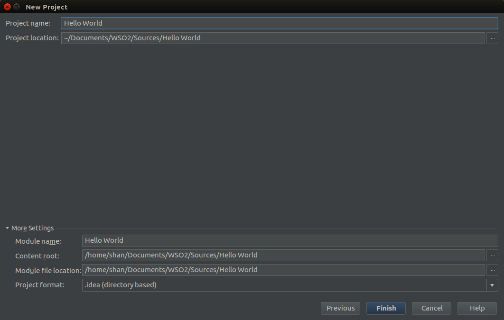
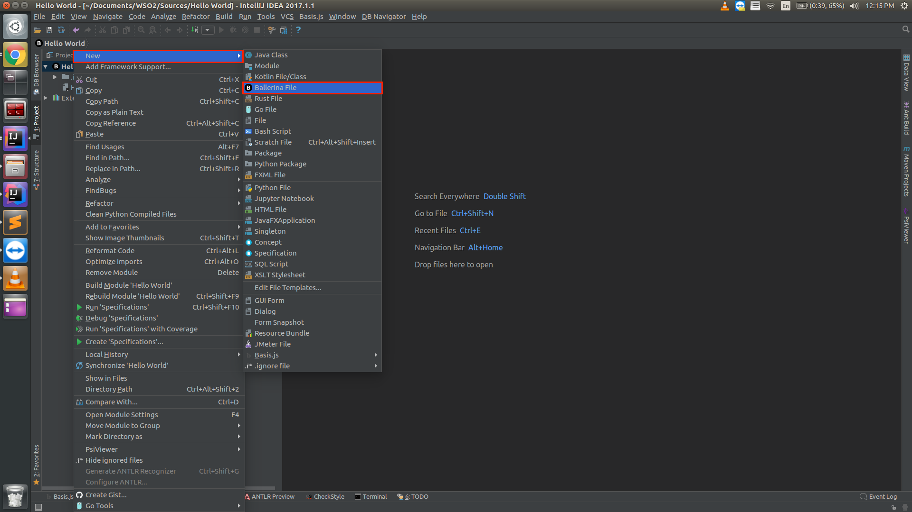
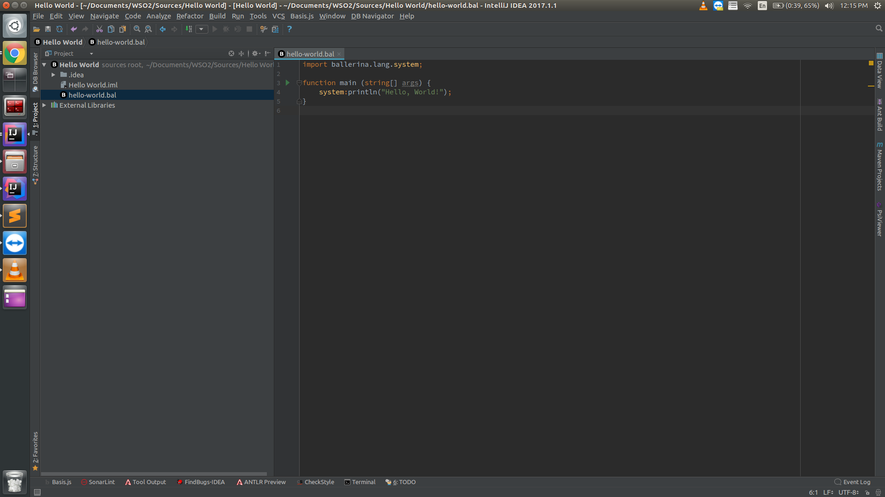
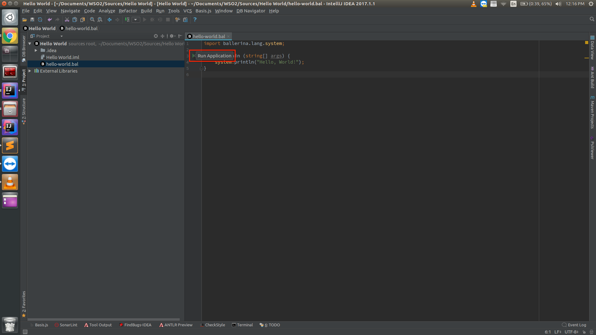
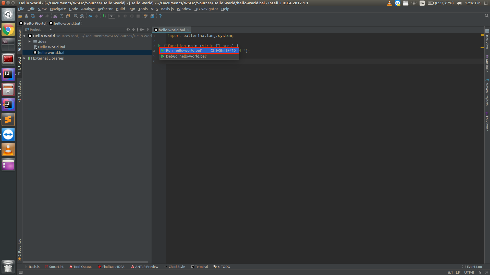
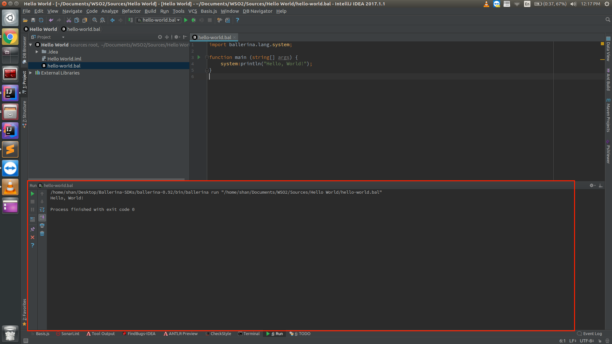
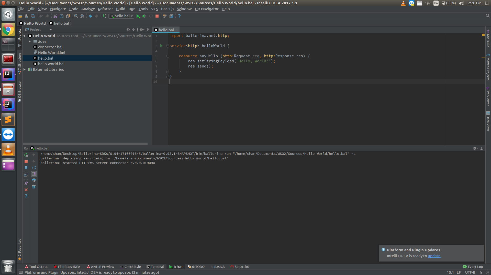

# Using the IntelliJ Ballerina Plugin

Click the links below to start using the IntelliJ Ballerina plugin after [installing it](#intellij-plugin-doc.md).

- [Creating a new Ballerina project](#creating-a-new-ballerina-project)
- [Creating a new Ballerina file](#creating-a-new-ballerina-file)
- [Running Ballerina files](#running-ballerina-files)
- [What's next?](#what's-next)

## Creating a new Ballerina project

Follow the steps below to create a new Ballerina project.

1. Open the editor, click **File** in the top menu, click **New**, and then click **Project**.

2. Select **Ballerina** as the type of the project, and click **Next**.

3. Select a Ballerina SDK for the project, and click **Next**.

    > **Tip:** If you do not have an already-configured Ballerina SDK to select, [configfure a new Ballerina SDK](#set-up-ballerina-sdk.md).

    

4. Enter a name for the project, a location to save it, and click **Finish**.

    

Now, you have successfully created a new Ballerina project.

## Creating a new Ballerina file

Follow the steps below to create a new Ballerina file within a Ballerina project.

1. Right-click on the name of the project, click **New**, and then click **Ballerina File**.

    

2. Enter a name for the file, and click **OK**. 

    > **Tip:** In this example, since the default **Main** template is selected as the **Kind**, it creates a new file with a main function.

    

Now, you have successfully created a new Ballerina file with a **main** function.

## Running Ballerina files

Click on the below links for instructions on how to run different elements of a Ballerina file.

- [Running the main method](#running-the-main-method)
- [Running Ballerina services](#running-ballerina-services)

### Running the main method

Follow the steps below to run the main function of a Ballerina file.

1. Click the green color icon located near the main function.

    

2. Click the corresponding **Run *<FILE_NAME>*** command.

    

This executes the main function of the Ballerina file and displays the output in the **Run** window.

> **Tip:** Alternatively, you can right click on the name of the file and run the main method of it.

### Running Ballerina services

Follow the steps below to run a service of a Ballerina file.

1. Click the green color icon located near the definition of the service.

2. Click the corresponding **Run *<FILE_NAME>*** command.

This starts the service and displays the output in the **Run** window. If you have multiple services in the Ballerina file, this starts all of them.

> **Tip:** Alternatively, you can right click on the name of the file and run the service(s) of it.

## What's next?

Next, for information on using the features of the IntelliJ Ballerina plugin, see [Using the IntelliJ plugin features](#using-interllij-plugin-features).